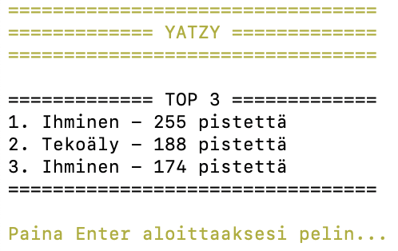
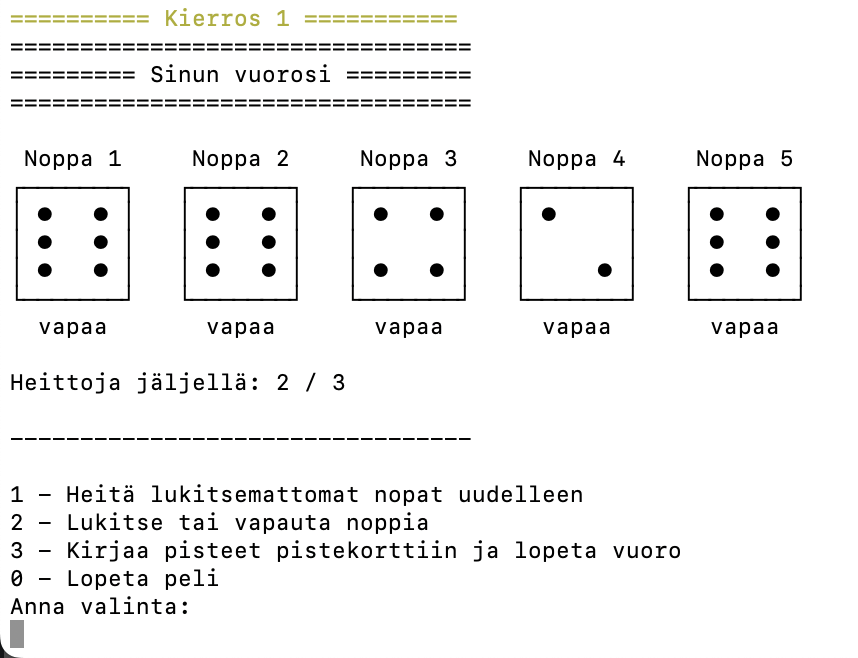
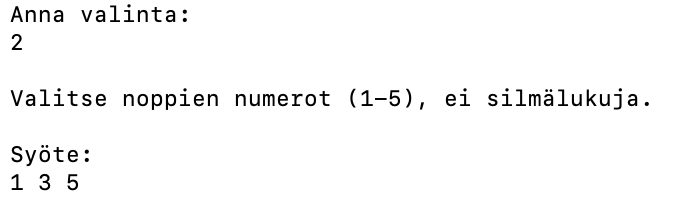
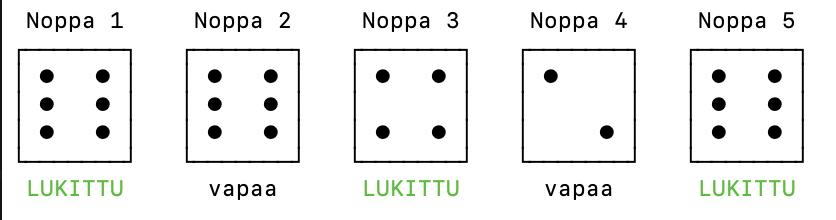
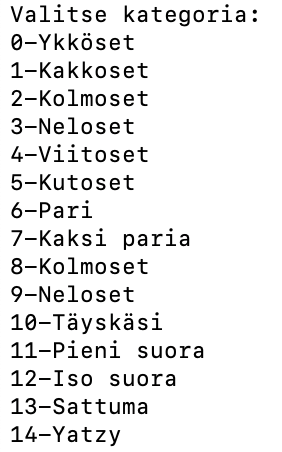
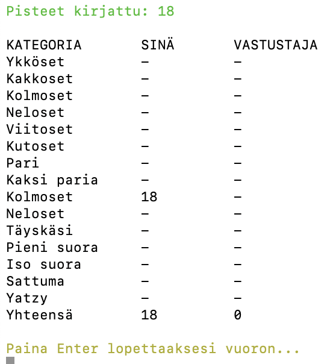
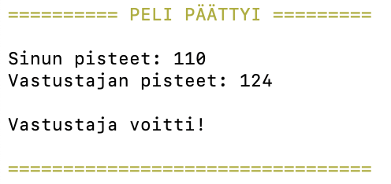

# Yatzy
#### Laura Laakso, laurkl@utu.fi, TKO_7100
#### Löytyy osoitteesta <https://gitlab.utu.fi/dfte/tko7100-3004/laura_laakso_2026/yatzy-harjoitustyo>

## Pelin kuvaus
Komentoriviltä pelattava yatzy peli, jossa käyttäjä pelaa tekoälypelaajaa vastaan.
Pelaaja voi vuorollaan heittää noppia uudelleen sekä lukita ja vapauttaa haluamiaan
noppia tavoitellakseen mahdollisimman hyviä pisteitä eri kategorioissa.
Pelissä on toteutettu tekoälyvastustaja, joka pyrkii saamaan mahdollisimman suuren
pistemäärän valitsemalla nopilleen parhaan mahdollisen kategorian.
Peli sisältää myös high score ominaisuuden, joka tallentaa pelien parhaat tulokset
JSON-tiedostoon ja näyttää käyttöliittymässä listan top 3 parhaimmista tuloksista.

## Yatzyn säännöt
Tarkemmat yatzyn säännöt löytyvät [Lautapeliopas sivulta](https://www.lautapeliopas.fi/saannot/yatzy/).

## Käyttöohje

### 1. Pelin käynnistäminen
Projektissa käytetään Mavenia, joka hoitaa automaattisesti tarvittavien kirjastojen lataamisen, ohjelman kääntämisen sekä ohjelman paketoinnin.

Lataa projekti GitLabista ja siirry terminaalissa projektikansioon komennolla: `cd Yatzy`

Käännä ja paketoi ohjelma komennolla: `mvn package`

Tämän jälkeen käynnistä peli komennolla: `java -jar target/Yatzy-1.0-SNAPSHOT.jar`

Peli käynnistyy ja näyttää tervetuloviestin sekä high score -listan.

Tämän jälkeen käyttäjä voi aloittaa pelin painamalla Enter-näppäintä.

### 2. Vuoron pelaaminen
Pelaajan vuorolla ohjelma heittää ensin kaikki viisi noppaa. Tämän jälkeen käyttäjä voi valita eri toimintoja.

Valinta tehdään kirjoittamalla haluttu numero ja painamalla Enter.

### 3. Noppien lukitseminen ja vapauttaminen
Käyttäjä voi lukita tai vapauttaa noppia valitsemalla vaihtoehdon `2`.

Ohjelma pyytää tämän jälkeen syöttämään niiden noppien numerot, jotka halutaan lukita tai vapauttaa. Huom! Erottele haluttujen noppien numerot välilyönnillä.

Lukitut nopat merkitään käyttöliittymässä tekstillä LUKITTU

### 4. Pisteiden kirjaaminen
Kun käyttäjä haluaa kirjaa pisteet pistekorttiin ja lopettaa vuoronsa, valitaan vaihtoehto `3`.

Ohjelma näyttää kaikki vapaat kategoriat, joihin pisteet voi kirjata:

Käyttäjä kirjoittaa haluamansa kategorian numeron ja ohjelma laskee pisteet automaattisesti.
Tämän jälkeen tulostetaan käyttäjän pistekortti.

### 5. Pelin päättyminen
Peli päättyy, kun kaikki 15 kierrosta on pelattu tai käyttäjä lopettaa pelin valitsemalla vaihtoehdon `0`.

Lopuksi ohjelma näyttää molempien pelaajien pisteet sekä voittajan ja tallentaa tulokset high score -listaan.

## Tekninen toteutus

Ohjelma on jaettu useisiin eri luokkiin siten, että jokaisella luokalla on oma selkeä vastuunsa. Tämä helpottaa ohjelman ylläpitämistä ja tekee koodista selkeämpää lukea.

Pelin toimintaa ohjaa `Yatzy`-luokka, joka hallitsee pelin kierroksia, pelaajien vuoroja sekä pelin päättymistä. Varsinaiset pelaajat on toteutettu erillisinä luokkina `IhmisPelaaja` ja `TekoalyPelaaja`. Molemmat toteuttavat saman `Pelaaja`-rajapinnan, jolloin molempia pelaajia voidaan käsitellä samalla tavalla pelin aikana. Rajapinnan avulla ohjelmaan voisi myöhemmin lisätä helposti esimerkiksi uudenlaisen tekoälyn tai moninpelin.

Noppien toiminta on jaettu kahteen eri luokkaan. `Noppa`-luokka vastaa yhden nopan toiminnasta, kuten heittämisestä ja lukitsemisesta. `NoppaLogiikka`-luokka puolestaan hallitsee kaikkia viittä noppaa yhdessä. Tämä ratkaisu mahdollistaa sen, että samoja metodeja voidaan käyttää sekä ihmispelaajalla että tekoälypelaajalla ilman, että samaa logiikkaa tarvitsee kirjoittaa useaan kertaan.

Pisteiden laskeminen on toteutettu erillisessä `PisteLaskuri`-luokassa. Luokka sisältää eri Yatzy-kategorioiden pisteytyslogiikan. Noppien silmälukujen määriä lasketaan taulukon avulla, minkä perusteella ohjelma tunnistaa esimerkiksi parit, kolmoset, suorat ja Yatzyn.

Pelaajan pisteet tallennetaan `Pistekortti`-luokkaan. Luokka huolehtii pisteiden kirjaamisesta, täytettyjen kohtien tarkistamisesta sekä yhteispisteiden laskemisesta.

Komentorivin tulostukset erotettiin omaan `Kayttoliittyma`-luokkaansa. Esimerkiksi noppien ASCII-kuvien tulostaminen toteutettiin siellä. Tämä selkeytti erityisesti `IhmisPelaaja`-luokkaa, josta olisi muuten tullut hyvin pitkä ja vaikeammin ylläpidettävä.

Projektissa käytetään myös Jackson-kirjastoa high score -tulosten tallentamiseen JSON-muotoon. `HighScore`-luokka tallentaa pelitulokset tiedostoon ja lukee ne takaisin ohjelman käynnistyessä.

Projektissa hyödynnettiin useita olio-ohjelmoinnin keskeisiä käsitteitä, kuten rajapintoja, kapselointia ja luokkien välistä yhteistyötä. Esimerkiksi useimpien luokkien attribuutit määriteltiin private-muuttujiksi, jolloin tietoa käsitellään hallitusti metodien kautta.

## Tekniset haasteet
Projektin aikana huomasin ongelman pelin komentorivin tulostuksessa. Kun käyttäjä scrollasi komentoriviä kesken pelin, Enter-näppäimen syötteet rekisteröityivät välillä virheellisesti. Tämän takia käyttäjän piti painaa Enter-näppäintä kahdesti, aiheuttaen sen, että tekoälyvastustajan vuoron tulostus jäi huomioimatta.

Aloin selvittää ongelmaa muuttamalla ohjelman toimintaa siten, että koko ohjelmassa käytettiin vain yhtä Scanner-oliota. Tällä halusin varmistaa, ettei ongelma johtunut useiden Scanner-olioiden käytöstä. Muutos ei kuitenkaan poistanut ongelmaa.
Tämän jälkeen testasin ohjelmaa IntelliJ IDEAn ulkopuolella normaalissa terminaalissa Mavenin kautta. Terminaalissa ohjelma toimi normaalisti eikä vastaavaa ongelmaa esiintynyt.

Täten päädyin siihen johtopäätökseen, että ongelma liittyy IntelliJ IDEAn sisäiseen komentoriviin eikä varsinaisesti ohjelman logiikkaan, minkä vuoksi en jatkanut ongelman korjaamista pidemmälle.

## Jatkokehitys
Peli valmistui yatzy-pelin ohjeiden mukaisesti ja sisältää kaikki tehtävänannossa vaaditut ominaisuudet. 
Ohjelmaa olisi kuitenkin mahdollista kehittää edelleen monella tavalla.

Yksi mahdollinen parannus olisi käyttöliittymän kehittäminen näyttävämmäksi. Esimerkiksi tilanteessa, jossa pelaaja tai tekoäly saa Yatzyn, ohjelma voisi tulostaa komentoriville erillisen korostetun ilmoituksen tai animaation.
Toinen mahdollinen jatkokehitysidea olisi toteuttaa pelistä graafinen käyttöliittymä tai verkkosivulla toimiva versio. Tällöin peliä olisi helpompi käyttää ja useampi käyttäjä voisi pelata sitä ilman ohjelmointiympäristön tai terminaalin käyttöä.

Lisäksi tekoälyä voisi kehittää älykkäämmäksi. Nykyinen tekoäly pyrkii keskittymään yleisimpiin silmälukuihin ja valitsemaan niille parhaan kategorian, mutta jatkossa tekoäly voisi tehdä strategisempia päätöksiä koko pelin tilanteen perusteella.

